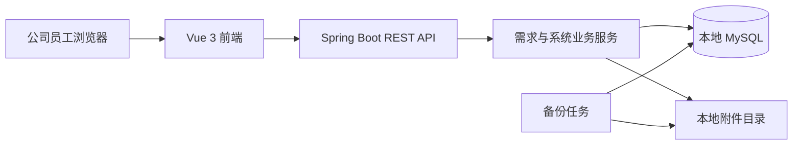

# 公司内部需求收集系统开发计划书

> 版本：1.4
> 日期：2026-07-15
> 项目类型：公司内部 Web 系统  
> 第一版部署方式：可迁移的本地部署  
> 技术路线：Vue 3 + Spring Boot + MySQL

## 1. 项目概述

### 1.1 项目背景

公司内部的系统需求目前需要一个统一入口进行收集、保存、查询和管理。本项目建设一个浏览器访问的内部需求收集平台，使员工可以规范填写需求，使相同系统的需求能够集中归类，并通过系统、部门、填写人、填写时间和需求状态快速筛选。

### 1.2 建设目标

1. 提供统一、易用的需求填写入口。
2. 支持需求正式保存和临时暂存，避免未完成内容丢失。
3. 将需求按所属系统统一归类和管理。
4. 支持需求详情查看、编辑、状态更新和安全删除。
5. 支持系统名称新增、编辑、停用、启用和删除。
6. 支持图片、PDF、Word、Excel 附件上传和下载。
7. 使用本地 MySQL，并保持后续迁移到公司内网服务器的能力。
8. 通过 BUG/需求类型标签区分记录性质。
9. 支持按上海时区选择需求开始日期和结束日期。
10. 为每个系统维护版本、负责人和多名协助人，并将需求分配到目标版本。
11. 需求列表打开后自动展示全部需求，并统一以上海时间展示填写时间。
12. 提供独立的管理需求页面，集中跟进所有尚未完成、关闭或拒绝的需求及草稿；菜单入口位于需求列表和系统管理之间。

### 1.3 第一版成功标准

- 用户能完整提交、暂存、恢复、编辑和删除一条需求。
- 选择“新系统”时能创建系统并自动加入系统列表。
- 同一系统的需求能通过系统筛选集中查看。
- 系统、部门、填写人、时间范围和状态组合筛选结果准确。
- 系统名称修改后，相关需求自动显示新名称。
- 已有关联需求的系统无法删除；没有关联需求的系统可二次确认后删除。
- 每条正式需求必须选择 BUG 或需求类型。
- 需求可选择上海时区下的开始日期和结束日期，并可按时间周期筛选。
- 每个系统可维护独立版本列表；需求处理时可选择该系统的目标版本。
- 每个系统必须有一名负责人，并可配置多名协助人。
- 需求列表首次打开时直接展示全部未删除需求，无需先点击查询。
- 需求填写时间在列表、详情和管理需求页面中统一按 `Asia/Shanghai` 显示。
- 管理需求为独立主菜单页面，包含正式需求和暂存草稿；正式需求状态为已完成、已关闭或已拒绝后移出页面。
- 管理需求支持填写完成时间、处理人和完成情况。
- 支持附件上传、下载和删除，上传过程有进度及明确的成功/失败提示。
- 数据库和附件目录可以通过配置迁移到另一台服务器。

## 2. 项目范围

### 2.1 第一版包含

- 左侧菜单与统一页面框架。
- 填写需求页面。
- 需求列表及组合筛选。
- 独立的管理需求页面和需求处理表单。
- 需求详情、编辑、状态更新、删除。
- 草稿暂存和恢复编辑。
- 系统管理。
- 系统版本管理。
- 系统负责人和协助人维护。
- 需求类型与时间周期管理。
- 附件上传、下载和删除。
- 表单校验、操作提示、离开页面提醒和删除确认。
- 本地 MySQL、数据库迁移脚本、附件目录配置和备份说明。
- 自动化测试、部署说明和使用说明。

### 2.2 第一版不包含

- 登录、角色、权限和部门数据权限。
- 审批流、会签和多级审核。
- 邮件、短信、企业微信、钉钉等消息通知。
- Excel 批量导出、统计报表和大屏。
- 与公司现有系统的单点登录或数据接口集成。
- 移动端原生 App；网页仅保证常见桌面浏览器可用，并做基础响应式适配。

上述功能可作为第二阶段扩展，不影响第一版的数据结构和接口边界。

### 2.3 第一版实施假设

- 界面语言为简体中文，时间统一按 `Asia/Shanghai` 保存和展示。
- 姓名和部门使用自由文本，不建设员工或部门基础数据表。
- 第一版主要面向桌面浏览器，支持当前公司统一使用的 Chrome 或 Edge。
- 所有能访问本地应用地址的人员都能查看和修改全部数据。
- 需求正文按纯文本保存和展示，不支持富文本 HTML。
- “关联需求”指未被软删除的需求；已软删除需求不阻止系统删除。

## 3. 业务规则

### 3.1 需求保存类型

- **暂存**：保存为草稿，允许部分必填项未完成；草稿不计入正式需求统计。
- **正式保存**：完成必填校验后提交，系统自动记录填写时间，并将需求状态设置为“待评估”。
- 草稿可从需求列表的“草稿”筛选中重新打开并继续编辑。
- 草稿转为正式需求时记录首次正式保存时间；后续编辑只更新最后修改时间。

### 3.2 需求列表默认展示与上海时间

- 需求列表页面加载完成后自动执行一次无条件查询，直接展示全部未删除需求，不要求用户先点击“查询”。
- 未设置筛选条件时，正式需求按首次正式填写时间倒序排列；暂存草稿按最后更新时间倒序排列，并统一显示在同一列表中。
- 用户设置任意筛选条件后，列表按筛选条件查询，分页和重置行为保持不变。
- 填写时间使用上海时间显示，格式统一为 `YYYY-MM-DD HH:mm:ss`；正式需求显示首次正式保存时间，草稿显示最后暂存时间。
- 详情页和管理需求页面使用与需求列表相同的时间格式和时区，避免同一条记录显示不一致。

### 3.3 需求类型

- 每条正式需求必须选择一个类型：`BUG` 或 `需求`。
- 类型为必填单选字段，草稿阶段允许暂不选择。
- 列表中使用明显的标签样式展示，并支持按类型筛选。
- 第一版类型选项固定，不提供自定义标签管理。

### 3.4 需求时间周期

- 每条需求可选择开始日期和结束日期，例如 `2026-07-10 至 2026-07-20`。
- 日期选择和展示按 `Asia/Shanghai` 时区处理，数据库使用 `DATE` 保存，不受服务器系统时区变化影响。
- 结束日期不得早于开始日期；开始日期和结束日期必须同时填写或同时为空。
- 周期天数按包含开始日和结束日的自然日计算，上述示例为 11 天。
- 需求列表支持按周期开始日期、周期结束日期和周期重叠范围筛选。
- 时间周期可在新建时填写，也可在后续处理需求时补充或修改。

### 3.5 需求状态

正式需求支持以下状态：

1. 待评估
2. 已确认
3. 开发中
4. 暂停
5. 已完成
6. 已拒绝
7. 已关闭

第一版不设置状态流转权限和强制顺序，可在编辑页直接选择状态。每次状态变更更新“状态更新时间”。“草稿”是保存类型，不属于需求状态。

### 3.6 所属系统与版本

- 用户可选择已有且处于启用状态的系统。
- 用户可选择“新系统”；选择后必须填写系统名称。
- 新系统名称通过正式保存或暂存成功后自动加入系统列表。
- 用户可选择“暂无系统”，此时需求的 `system_id` 为空。
- 系统名称忽略首尾空格后不得重复；英文名称按不区分大小写校验。
- 系统改名后，所有关联需求自动显示新名称。
- 每个系统独立维护版本列表，例如客户管理系统的 V1.0、V1.1、V2.0。
- 同一系统内版本名称不得重复，不同系统可使用相同版本名称。
- 新建需求时目标版本可以为空；处理需求时可选择目标版本。
- 目标版本只能来自当前所属系统；更换所属系统时清空原目标版本并提示重新选择。
- 选择“暂无系统”时不能选择目标版本。
- 需求列表中的版本筛选与系统筛选联动：先选择系统，再加载该系统版本。
- 版本支持新增、编辑、停用、启用和删除；已关联有效需求的版本不可删除。
- 编辑历史需求时允许保留已经停用的目标版本；主动更换版本时只能选择启用版本。

### 3.7 系统负责人和协助人

- 每个系统必须设置一名负责人。
- 每个系统可设置零名或多名协助人，同一姓名在同一系统中不得重复。
- 第一版使用姓名文本录入，不关联账号、员工表或通讯录。
- 负责人和协助人可在系统管理页面修改。
- 填写需求时选择“新系统”，同步显示新系统名称、负责人和协助人字段；名称与负责人必填，协助人选填。
- 从需求表单创建新系统时，系统版本暂不要求填写，可在系统管理页面后续维护。

### 3.8 系统停用与删除

- 停用后保留系统及其历史需求，但新建需求时不再显示该系统。
- 停用系统可重新启用。
- 关联有效需求数大于 0 时禁止删除，并提示先迁移相关需求。
- 迁移目标可为另一个启用系统或“暂无系统”。
- 关联有效需求数为 0 时允许删除，执行前必须二次确认。
- 后端必须再次校验关联关系，不能只依赖前端按钮禁用。

### 3.9 管理需求页面

- 管理需求是独立页面，不嵌入需求列表；通过左侧“管理需求”菜单进入，菜单位置固定在“需求列表”和“系统管理”之间。
- 管理范围包括正式需求和暂存草稿。
- 正式需求中，状态为待评估、已确认、开发中或暂停的记录进入管理需求；状态为已完成、已关闭或已拒绝的记录不进入管理需求。
- 草稿没有正式需求状态，统一视为待处理并进入管理需求，直到正式提交或被删除。
- 管理需求默认按最近填写或暂存时间倒序，新需求排在上方；每条记录显示标题、类型、系统/版本、填写人/部门、填写时间、当前状态和最后修改时间。
- 点击管理需求记录进入处理详情页。处理详情页允许修改需求状态，并填写完成时间、处理人和完成情况。
- 完成时间使用上海时间，精确到日期和时间；处理人使用文本字段；完成情况使用多行文本字段。
- 当状态改为已完成、已关闭或已拒绝时，保存成功后该记录立即从管理需求页面移除，但仍可在普通需求列表中按条件查询。
- 状态改回待评估、已确认、开发中或暂停时，记录重新进入管理需求页面。
- 管理需求保存使用需求的乐观锁版本号，冲突时提示用户刷新后重试。

### 3.10 删除规则

- 需求删除采用软删除，列表默认不展示，数据库保留删除时间。
- 系统删除在业务上表现为删除，数据库采用软删除标记，以保留数据一致性和恢复空间。
- 附件随需求软删除而停止展示，不立即清理物理文件；文件清理可由后续维护任务执行。

## 4. 页面与交互设计

### 4.1 菜单结构

左侧菜单包含：

- 填写需求
- 需求列表
- 管理需求
- 系统管理

页面顶部显示当前页面名称。填写需求页面不显示“返回”按钮，用户通过左侧菜单切换页面；详情页继续提供明显的“返回”按钮。

### 4.2 填写需求页面

| 字段 | 类型 | 正式保存规则 | 暂存规则 |
| --- | --- | --- | --- |
| 姓名 | 单行文本 | 必填，2–50 字符 | 可为空 |
| 部门 | 单行文本 | 必填，2–50 字符 | 可为空 |
| 填写时间 | 系统字段 | 正式保存时自动生成，不可修改 | 显示最后暂存时间 |
| 需求标题 | 单行文本 | 必填，2–100 字符 | 可为空 |
| 类型 | 单选标签 | 必填，BUG 或需求 | 可为空 |
| 需求时间周期 | 日期范围 | 选填；开始与结束必须同时填写，结束不得早于开始 | 可为空 |
| 所属系统 | 选择框 | 必填，可选已有、新系统、暂无系统 | 可为空 |
| 新系统名称 | 条件文本框 | 选择新系统时必填，2–100 字符 | 选择新系统时可暂不填写 |
| 新系统负责人 | 条件文本框 | 选择新系统时必填，2–50 字符 | 可为空 |
| 新系统协助人 | 条件多值文本 | 选择新系统时选填，可添加多人 | 可为空 |
| 目标版本 | 联动选择框 | 选填；仅显示当前所属系统的启用版本 | 可为空 |
| 需求状态 | 选择框 | 新建默认待评估；编辑时可修改 | 草稿不设置业务状态 |
| 需求内容 | 多行文本框 | 必填，10–10000 字符 | 可为空 |
| 附件 | 文件上传 | 可选 | 可选 |

页面操作：

- **暂存**：保存草稿，提示“暂存成功”。
- **保存需求**：校验必填项并正式提交，提示“保存成功”，随后进入详情页或返回列表。
- 页面不提供单独的“返回”按钮；通过左侧菜单离开填写页时，如有未保存修改则弹出提醒。
- 提交过程中按钮进入加载状态，防止重复提交。

### 4.3 需求列表页面

筛选条件：

- 关键词：匹配需求标题和需求内容。
- 所属系统：包括全部系统、具体系统和暂无系统。
- 部门。
- 填写人。
- 填写时间开始日期和结束日期，包含边界日期。
- 需求状态。
- 需求类型：BUG 或需求。
- 目标版本：选择系统后加载对应版本。
- 需求周期：可按开始日期、结束日期或与查询区间存在重叠进行筛选。
- 保存类型：正式需求或草稿。

列表字段：

- 需求标题
- 类型标签
- 所属系统
- 目标版本
- 部门
- 填写人
- 填写时间
- 需求时间周期与周期天数
- 需求状态
- 最后修改时间
- 操作

列表操作：查看详情、编辑、删除。页面首次打开自动加载全部需求；列表默认按正式填写时间倒序，草稿按最后暂存时间倒序，支持分页，每页默认 20 条。填写时间统一按上海时间显示，格式为 `YYYY-MM-DD HH:mm:ss`。筛选条件在分页切换时保持不变，点击“重置”恢复默认条件。

需求列表页面仅负责全部需求的查询、筛选、查看、编辑和删除，不再在列表下方展示管理需求区域。待处理工作统一从独立的“管理需求”菜单进入。

### 4.4 管理需求页面

- 页面为独立主菜单页面，使用独立的页面组件和菜单状态，不嵌入需求列表组件；是否采用 URL 路由不作为第一版强制要求。
- 页面顶部显示“管理需求”标题和待处理总数，主体为待处理需求列表。
- 自动展示正式需求中非已完成、非已关闭、非已拒绝的记录，以及全部暂存草稿。
- 默认按最近填写、提交或暂存时间倒序，新需求排在上方。
- 列表显示类型、标题、系统/版本、填写人/部门、填写时间、当前状态、最后修改时间和操作。
- 点击需求进入处理详情，支持修改状态、填写完成时间、处理人和完成情况，并提供返回管理需求列表的按钮。
- 状态保存为已完成、已关闭或已拒绝后，管理需求页面自动刷新并移除该记录。
- 空列表显示“暂无待处理需求”，加载或保存失败时显示明确提示并保留已填写内容。

页面结构草图：

```text
┌──────────────┬──────────────────────────────────────────┐
│ 需求收集平台 │ 管理需求                                 │
│              ├──────────────────────────────────────────┤
│ 填写需求     │ 待处理总数                              │
│ 需求列表     │ ┌──────────────────────────────────────┐ │
│ ▶ 管理需求   │ │ 待处理需求与草稿列表               │ │
│ 系统管理     │ │ 标题 / 系统版本 / 人员 / 状态 / 操作│ │
│              │ └──────────────────────────────────────┘ │
│              │ 点击记录 → 填写处理情况 → 保存 / 返回   │
└──────────────┴──────────────────────────────────────────┘
```

### 4.5 需求详情页面

- 展示需求全部字段和附件列表。
- 展示 BUG/需求类型标签、目标版本和需求时间周期。
- 展示正式填写时间、最后修改时间和当前状态。
- 提供返回、编辑和删除按钮。
- 图片附件可在浏览器预览；其他附件提供下载。

### 4.6 编辑需求页面

- 复用填写需求表单和校验规则。
- 支持更换所属系统、修改内容、增删附件和修改需求状态。
- 支持修改类型、需求时间周期和目标版本。
- 如果选择停用系统作为历史值，页面允许保留；用户主动更换时只能选择启用系统或暂无系统。
- 保存成功后返回详情页并显示成功提示。

### 4.7 系统管理页面

筛选条件：系统名称、启用状态、负责人和协助人。

列表字段：系统名称、负责人、协助人、版本数、关联需求数、状态、创建时间、最后修改时间、操作。

操作包括：

- 新增系统。
- 编辑系统名称。
- 编辑负责人和协助人。
- 进入版本管理，新增、编辑、停用、启用或删除版本。
- 停用或启用。
- 查看该系统全部需求。
- 删除系统。

当系统存在关联需求时，删除按钮置灰并显示原因；后端仍必须执行相同校验。

### 4.8 系统版本管理页面

- 从系统管理页面进入指定系统的版本管理。
- 页面显示当前系统名称、负责人和协助人。
- 版本列表字段包括版本名称、状态、关联需求数、创建时间和操作。
- 支持新增、编辑、停用、启用和删除版本。
- 停用版本不再出现在需求的目标版本选择框中，但历史需求继续显示该版本。
- 已有关联有效需求的版本不可删除；无关联需求的版本可二次确认后删除。

### 4.9 通用交互

- 保存、暂存、编辑、删除、启停均有明确的成功或失败提示。
- 必填字段在字段下方显示具体错误信息。
- 删除、停用等操作使用二次确认对话框。
- 请求失败时保留用户已经输入的表单内容。
- 空列表显示空状态和“填写新需求”入口。
- 长文本在列表中截断，详情页完整展示。
- 附件上传显示单文件进度、完成状态和失败原因。

## 5. 技术架构

### 5.1 技术选型

| 层级 | 技术 | 用途 |
| --- | --- | --- |
| 前端 | Vue 3、TypeScript、Vite、Element Plus | 页面、表单、列表和交互组件 |
| 状态与请求 | Pinia、Axios | 页面状态和 REST API 调用 |
| 后端 | Java LTS、Spring Boot 3.x | REST API 与业务逻辑 |
| 数据访问 | Spring Data JPA | MySQL 数据访问 |
| 数据库迁移 | Flyway | 表结构版本管理 |
| 数据库 | MySQL 8.x | 需求、系统和附件元数据 |
| 文件存储 | 本地文件目录 | 附件实体文件 |
| 接口文档 | OpenAPI/Swagger | API 查看与联调 |
| 后端测试 | JUnit 5、Spring Boot Test、Testcontainers | 单元和集成测试 |
| 前端测试 | Vitest、Vue Test Utils | 组件和逻辑测试 |
| 端到端测试 | Playwright | 关键用户流程测试 |

具体依赖小版本在项目初始化时锁定为当时稳定版本，并提交锁文件，避免构建结果漂移。

### 5.2 总体结构



### 5.3 后端模块边界

- `requirement`：需求创建、暂存、编辑、类型、时间周期、目标版本、查询、筛选、状态和删除。
- `system`：系统新增、改名、负责人、协助人、启停、关联统计、迁移和删除校验。
- `version`：系统版本新增、编辑、启停、关联校验和删除。
- `attachment`：流式上传、元数据保存、下载、删除和路径安全。
- `common`：统一响应、异常处理、校验、分页和审计时间字段。
- `configuration`：数据库、附件目录、跨域和环境配置。

模块之间通过服务接口调用，控制器不直接访问数据仓库，附件模块不包含需求业务判断。

### 5.4 部署结构

开发阶段前后端分别启动。生产构建时将 Vue 静态文件集成到 Spring Boot 静态资源中，形成单一应用包，减少本地部署组件数量。

外部依赖仅包括：

- Java 运行环境。
- MySQL 服务。
- 可读写的附件目录。

数据库地址、账号、密码、应用端口和附件目录通过环境变量或外部配置文件提供，不写死在代码中。

## 6. 数据库设计

### 6.1 `systems` 系统表

| 字段 | 类型建议 | 说明 |
| --- | --- | --- |
| id | BIGINT | 主键 |
| name | VARCHAR(100) | 系统名称，规范化后唯一 |
| active_name_key | VARCHAR(100) | 启用唯一约束的规范化名称；已删除记录为空 |
| owner_name | VARCHAR(50) | 系统负责人，必填 |
| status | VARCHAR(20) | ACTIVE、INACTIVE |
| is_deleted | BOOLEAN | 删除标记 |
| created_at | DATETIME | 创建时间 |
| updated_at | DATETIME | 修改时间 |
| deleted_at | DATETIME | 删除时间，可为空 |

索引：`active_name_key` 唯一索引、负责人索引、状态与删除标记组合索引。`active_name_key` 保存去除首尾空格并统一大小写后的名称；软删除时置空，使同名系统后续可以重新创建，同时避免未删除系统重名。

### 6.2 `system_collaborators` 系统协助人表

| 字段 | 类型建议 | 说明 |
| --- | --- | --- |
| id | BIGINT | 主键 |
| system_id | BIGINT | 所属系统 |
| collaborator_name | VARCHAR(50) | 协助人姓名 |
| created_at | DATETIME | 创建时间 |

唯一约束：`system_id, collaborator_name`，防止同一系统重复添加同一协助人。系统软删除后该表记录保留。

### 6.3 `system_versions` 系统版本表

| 字段 | 类型建议 | 说明 |
| --- | --- | --- |
| id | BIGINT | 主键 |
| system_id | BIGINT | 所属系统 |
| name | VARCHAR(100) | 版本名称 |
| active_name_key | VARCHAR(100) | 未删除版本的规范化名称；已删除记录为空 |
| status | VARCHAR(20) | ACTIVE、INACTIVE |
| created_at | DATETIME | 创建时间 |
| updated_at | DATETIME | 修改时间 |
| is_deleted | BOOLEAN | 删除标记 |
| deleted_at | DATETIME | 删除时间，可为空 |

唯一约束：`system_id, active_name_key`。版本软删除时将 `active_name_key` 置空，从而允许重新创建同名版本。索引包括 `system_id, status, is_deleted`。

### 6.4 `requirements` 需求表

| 字段 | 类型建议 | 说明 |
| --- | --- | --- |
| id | BIGINT | 主键 |
| requester_name | VARCHAR(50) | 填写人姓名 |
| department | VARCHAR(50) | 部门 |
| title | VARCHAR(100) | 需求标题 |
| requirement_type | VARCHAR(20) | BUG、REQUIREMENT |
| system_id | BIGINT | 所属系统，可为空 |
| target_version_id | BIGINT | 目标系统版本，可为空 |
| period_start_date | DATE | 需求周期开始日期，按上海日期解释 |
| period_end_date | DATE | 需求周期结束日期，按上海日期解释 |
| content | TEXT | 需求内容 |
| save_type | VARCHAR(20) | DRAFT、SUBMITTED |
| status | VARCHAR(30) | 正式需求状态，草稿为空 |
| submitted_at | DATETIME | 首次正式保存时间 |
| status_updated_at | DATETIME | 状态更新时间 |
| completed_at | DATETIME | 完成时间，按上海时间解释，可为空 |
| handled_by | VARCHAR(50) | 处理人，可为空 |
| completion_description | TEXT | 完成情况，可为空 |
| created_at | DATETIME | 记录创建时间 |
| updated_at | DATETIME | 最后修改时间 |
| is_deleted | BOOLEAN | 删除标记 |
| deleted_at | DATETIME | 删除时间，可为空 |

外键：`system_id` 关联 `systems.id`，`target_version_id` 关联 `system_versions.id`；删除策略为限制或保留，不使用级联删除。服务层必须校验目标版本属于所选系统。

主要索引：

- `system_id, is_deleted`
- `target_version_id, is_deleted`
- `requirement_type, is_deleted`
- `period_start_date, period_end_date, is_deleted`
- `department, is_deleted`
- `requester_name, is_deleted`
- `submitted_at, is_deleted`
- `status, is_deleted`
- `save_type, is_deleted`

关键词查询第一版使用标题普通索引加内容模糊匹配；当数据规模显著增加时再评估全文索引。

### 6.5 `attachments` 附件表

| 字段 | 类型建议 | 说明 |
| --- | --- | --- |
| id | BIGINT | 主键 |
| requirement_id | BIGINT | 所属需求 |
| original_name | VARCHAR(255) | 原始文件名 |
| stored_name | VARCHAR(255) | 存储文件名，使用随机标识 |
| relative_path | VARCHAR(500) | 相对附件根目录的路径 |
| content_type | VARCHAR(100) | MIME 类型 |
| size_bytes | BIGINT | 文件大小 |
| checksum | VARCHAR(64) | SHA-256，可用于完整性校验 |
| created_at | DATETIME | 上传时间 |
| is_deleted | BOOLEAN | 删除标记 |
| deleted_at | DATETIME | 删除时间，可为空 |

附件实体文件不存入 MySQL，避免数据库膨胀。

## 7. API 规划

所有接口使用 `/api` 前缀，返回统一的数据、错误代码和错误信息结构。

### 7.1 需求接口

| 方法 | 路径 | 说明 |
| --- | --- | --- |
| POST | `/api/requirements/drafts` | 新建草稿 |
| PUT | `/api/requirements/{id}/draft` | 更新草稿 |
| POST | `/api/requirements` | 正式保存需求 |
| PUT | `/api/requirements/{id}` | 编辑需求或将草稿转正式 |
| GET | `/api/requirements/{id}` | 查看详情 |
| GET | `/api/requirements` | 分页与组合筛选 |
| PATCH | `/api/requirements/{id}/status` | 更新需求状态 |
| DELETE | `/api/requirements/{id}` | 软删除需求 |
| GET | `/api/requirements/management` | 查询独立管理需求页面中的待处理需求和草稿 |
| PATCH | `/api/requirements/{id}/processing` | 更新状态、完成时间、处理人和完成情况 |

### 7.2 系统接口

| 方法 | 路径 | 说明 |
| --- | --- | --- |
| POST | `/api/systems` | 新增系统并设置负责人、协助人 |
| PUT | `/api/systems/{id}` | 修改系统名称、负责人和协助人 |
| GET | `/api/systems` | 查询系统列表 |
| GET | `/api/systems/{id}/requirements` | 查询系统关联需求 |
| PATCH | `/api/systems/{id}/status` | 启用或停用 |
| POST | `/api/systems/{id}/migrate` | 批量迁移关联需求 |
| DELETE | `/api/systems/{id}` | 删除无关联需求的系统 |

### 7.3 系统版本接口

| 方法 | 路径 | 说明 |
| --- | --- | --- |
| POST | `/api/systems/{systemId}/versions` | 新增系统版本 |
| GET | `/api/systems/{systemId}/versions` | 查询系统版本列表 |
| PUT | `/api/system-versions/{id}` | 修改版本名称 |
| PATCH | `/api/system-versions/{id}/status` | 启用或停用版本 |
| DELETE | `/api/system-versions/{id}` | 删除无关联需求的版本 |

### 7.4 附件接口

| 方法 | 路径 | 说明 |
| --- | --- | --- |
| POST | `/api/requirements/{id}/attachments` | 流式上传附件 |
| GET | `/api/attachments/{id}` | 下载或预览附件 |
| DELETE | `/api/attachments/{id}` | 删除附件 |

## 8. 附件处理方案

### 8.1 支持范围

- 常见图片：JPG、JPEG、PNG、GIF、WEBP。
- PDF。
- Word：DOC、DOCX。
- Excel：XLS、XLSX。

### 8.2 大文件策略

业务层不设置单文件大小上限，但“无限大小”在物理上受浏览器、应用服务器超时、磁盘空间、文件系统和网络稳定性限制。因此实现必须：

- 使用流式上传到临时文件，禁止一次性读入内存。
- 显示上传进度，上传完成后再绑定到需求。
- 上传前检查磁盘剩余空间，并在空间不足时拒绝上传。
- 超时和请求体限制通过外部配置调整，默认值在部署文档中说明。
- 上传失败或取消时清理临时文件。
- 对原始文件名进行清洗，实体文件使用随机名称，防止路径穿越和覆盖。
- 同时校验扩展名和 MIME 类型；不执行上传文件中的任何内容。

## 9. 数据流与事务

### 9.1 正式保存需求

1. 前端校验必填项。
2. 后端再次校验字段和系统状态。
3. 选择新系统时，在同一事务中检查名称唯一性，并保存系统负责人和协助人。
4. 保存需求，状态设为待评估，记录正式填写时间。
5. 校验 BUG/需求类型、时间周期以及目标版本与所属系统的一致性。
6. 将已完成上传的临时附件绑定到需求。
7. 提交事务并返回需求 ID。
8. 前端显示成功提示并跳转详情页。

数据库失败时不得留下半条需求记录；附件绑定失败时返回明确错误，并保留可重试信息。

### 9.2 删除系统

1. 前端请求删除。
2. 后端统计该系统未删除需求数。
3. 数量大于 0 时返回业务错误和关联数量。
4. 数量为 0 时将系统标记为删除。
5. 返回删除成功，列表刷新。

关联统计和删除必须在事务内完成，避免并发新增需求造成误删。

## 10. 异常处理

### 10.1 统一错误类型

- 参数校验错误：指出具体字段和原因。
- 数据不存在：需求、系统或附件不存在。
- 数据冲突：系统名称重复、记录已被修改、系统存在关联需求。
- 文件错误：格式不支持、磁盘不足、上传中断、文件不存在。
- 数据库错误：记录日志，向用户返回可理解的通用提示。
- 未知错误：生成错误追踪编号，便于定位日志。

### 10.2 并发编辑

需求和系统表增加乐观锁版本字段，编辑时携带版本号。若其他人已经修改，返回冲突提示，要求用户刷新后重新编辑，避免静默覆盖。

## 11. 安全与数据保护

第一版没有登录和权限，但仍执行以下基础保护：

- 只在本机或受控内网监听，不直接暴露到互联网。
- 后端参数校验和数据库参数化查询。
- 文件路径规范化，禁止访问附件根目录之外的文件。
- 上传文件类型白名单和响应头安全设置。
- 前端对显示内容进行转义，需求内容不执行 HTML。
- 数据库账号使用最小权限，不使用 root 账号运行应用。
- 配置文件中的密码不提交到版本库。
- 删除使用软删除并记录时间。

无身份识别意味着任何能访问系统的人都能编辑和删除数据，这是第一版明确接受的风险。迁移到多人内网使用前，应优先增加登录和角色权限。

## 12. 性能与可维护性目标

- 在 10,000 条需求规模下，普通组合筛选的后端响应目标为 2 秒以内。
- 列表强制分页，不一次性返回全部数据。
- 附件上传和下载使用流式处理，内存占用不随文件大小等比例增长。
- 数据库字段、状态值和接口错误码集中管理。
- 使用 Flyway 管理数据库变更，禁止人工直接修改生产表结构。
- 前后端分别通过代码格式化、静态检查和自动化测试门禁。

## 13. 测试计划

### 13.1 测试策略

功能实现采用测试先行方式：先编写失败测试，再实现最小代码使测试通过，随后重构。测试分层如下：

- **后端单元测试**：字段校验、状态处理、系统删除规则、系统名称唯一规则。
- **后端集成测试**：使用真实 MySQL 测试容器验证 JPA 查询、事务、索引和并发规则。
- **前端组件测试**：条件字段显示、表单校验、按钮状态、筛选参数构造。
- **API 契约测试**：请求字段、分页格式和错误响应。
- **端到端测试**：浏览器完整操作关键流程。
- **人工验收测试**：页面易用性、大附件、异常提示和部署恢复。

### 13.2 必测场景

1. 新建普通需求并自动生成填写时间和待评估状态。
2. 暂存不完整需求，再次打开并正式提交。
3. 选择已有系统、新系统和暂无系统三种保存路径。
4. 重复新系统名称被阻止。
5. 按系统、部门、填写人、时间和状态单独及组合筛选。
6. 查看详情、编辑字段、修改状态和软删除。
7. 上传、下载、预览和删除每类支持文件。
8. 上传过程中断、磁盘不足和不支持格式时正确提示。
9. 系统改名后关联需求显示新名称。
10. 系统停用后不出现在新建需求选择框中，历史需求仍正常显示。
11. 有关联需求的系统删除失败；迁移后可删除。
12. 两个页面同时编辑同一条数据时触发冲突提示。
13. 数据库连接失败时页面不丢失已输入内容。
14. 需求内容包含脚本或特殊字符时只作为文本展示。
15. 正式保存时未选择 BUG/需求类型会被阻止，列表可按类型筛选。
16. 可选择上海日期范围，结束日期早于开始日期时提示错误。
17. 时间周期筛选能正确匹配落入区间和跨越区间的需求。
18. 目标版本只能选择当前系统的版本，更换系统后原版本被清空。
19. 停用版本不再可选，历史需求仍显示原版本。
20. 有关联需求的版本不可删除，无关联版本可删除。
21. 新建系统必须填写负责人，协助人可添加多人且不能重复。
22. 从需求表单创建新系统时，负责人和协助人正确保存。
23. 需求列表首次打开自动展示全部需求，不需要先点击查询。
24. 需求列表、详情和管理需求页面中的填写时间均按上海时间展示。
25. 管理需求包含正式未完成需求和暂存草稿，并按新近填写或暂存时间倒序。
26. 管理需求可保存状态、完成时间、处理人和完成情况。
27. 管理需求状态改为已完成、已关闭或已拒绝后不再显示，普通需求列表仍可查询。

## 14. 开发阶段与排期

以下排期按 1 名全栈开发人员估算，共约 22 个工作日；若前后端并行，可缩短日历时间，但总工作量基本不变。

### 阶段一：基础工程与数据库（第 1–4 个工作日）

- 初始化 Vue 3 与 Spring Boot 工程。
- 建立代码规范、测试框架和环境配置。
- 设计并创建系统、需求和附件表。
- 配置 Flyway、统一异常、分页和接口文档。
- 完成本地 MySQL 连接与开发启动脚本。

交付物：可启动的前后端骨架、首版数据库迁移、健康检查接口、基础测试流水线。

### 阶段二：系统管理（第 5–9 个工作日）

- 系统新增、列表、筛选和改名。
- 系统负责人和多协助人维护。
- 系统启用、停用、关联数统计。
- 系统删除校验和需求迁移接口。
- 系统版本新增、编辑、启停和删除保护。
- 系统管理页面与自动化测试。

交付物：可独立验收的系统管理模块。

### 阶段三：需求填写与附件（第 10–14 个工作日）

- 需求表单和条件字段交互。
- BUG/需求类型、上海日期周期和目标版本联动。
- 草稿暂存、恢复和正式保存。
- 新系统、负责人和协助人自动创建。
- 流式附件上传、下载、预览和删除。
- 表单离开提醒、上传进度和操作提示。

交付物：完整的需求填写、暂存和附件闭环。

### 阶段四：需求管理（第 15–19 个工作日）

- 需求分页列表和组合筛选。
- 需求列表首次打开自动加载全部需求。
- 列表、详情和管理需求页面统一使用上海时间展示填写时间。
- 类型、系统版本和时间周期筛选。
- 详情、编辑、状态更新和软删除。
- 增加独立的管理需求主菜单页面，菜单入口位于需求列表和系统管理之间，覆盖正式待处理需求和暂存草稿。
- 管理详情填写完成时间、处理人和完成情况，并支持状态更新后自动移除终态记录。
- 乐观锁冲突处理。
- 空状态、错误状态和分页交互。

交付物：完整的需求查询和管理闭环。

### 阶段五：联调、验收与部署（第 20–22 个工作日）

- 执行端到端和回归测试。
- 测试大附件、磁盘不足和断点异常场景。
- 优化索引、查询和页面体验。
- 制作生产构建包、配置模板和部署脚本。
- 编写用户手册、部署手册、备份与恢复手册。
- 修复验收问题并发布第一版。

交付物：可部署应用包、测试报告、使用文档、部署文档和备份恢复文档。

## 15. 工作分解与优先级

### P0：第一版必须完成

- 需求新建、暂存、正式保存。
- 系统选择、新系统创建和暂无系统。
- 需求状态。
- BUG/需求必填类型。
- 上海日期范围形式的需求时间周期。
- 需求目标版本和系统、版本联动筛选。
- 需求列表以及系统、版本、部门、填写人、填写时间、类型、状态和周期筛选。
- 需求列表初次打开自动显示全部需求，填写时间按上海时间展示。
- 独立的管理需求页面包含未完成正式需求和暂存草稿，可填写完成时间、处理人和完成情况。
- 详情、编辑、删除。
- 系统新增、改名、启停、删除保护。
- 系统负责人、多协助人和版本管理。
- 附件上传与下载。
- MySQL 与可配置本地部署。
- 自动化测试和备份说明。

### P1：第一版应完成

- 图片预览。
- 乐观锁冲突提示。
- 关键词搜索。
- 草稿筛选。
- 磁盘空间预检查。
- 完整的空状态和错误提示。

### P2：后续优化

- 需求导出。
- 状态变更历史。
- 操作日志。
- 首页数据统计。
- 登录、角色和权限。
- 审批、通知和第三方系统集成。

## 16. 验收标准

### 16.1 功能验收

- 填写需求、需求列表、管理需求、系统管理四个主菜单页面均可正常访问和返回，菜单顺序符合计划书。
- 所有必填校验、条件字段和提示符合本计划书。
- 暂存数据刷新浏览器后仍可恢复。
- 正式需求状态完整、可修改、可筛选。
- 正式需求必须包含 BUG 或需求类型；类型可展示和筛选。
- 需求时间周期可按上海日期选择、修改、展示和筛选。
- 需求列表不筛选时自动展示全部需求，填写时间在各页面均按上海时间显示。
- 管理需求页面准确包含正式未完成需求和暂存草稿；状态变为已完成、已关闭或已拒绝后自动移除。
- 管理需求可保存完成时间、处理人和完成情况。
- 目标版本只能来自所属系统，系统与版本筛选正确联动。
- 系统、版本、部门、填写人、填写时间、类型、状态和周期筛选可组合使用且分页数据正确。
- 系统管理的新增、改名、启停和删除规则正确。
- 每个系统有且仅有一名负责人，可维护多名协助人和多个版本。
- 所有支持类型附件均可上传和下载。
- 删除操作均二次确认，需求数据为软删除。

### 16.2 技术验收

- 全部自动化测试通过。
- 数据库可以从空库通过 Flyway 自动初始化。
- 应用配置中不包含硬编码的数据库密码和绝对附件路径。
- 在另一台机器修改配置后可连接新的 MySQL 和附件目录。
- 数据库和附件备份能够完成一次实际恢复演练。
- 关键错误写入日志，日志不包含数据库密码等敏感信息。

### 16.3 完成定义

只有同时满足以下条件，第一版才视为完成：

- P0 功能全部实现并通过验收。
- 不存在阻断使用的高优先级缺陷。
- 关键端到端流程测试通过。
- 部署、使用、备份和恢复文档齐全。
- 已在目标本地环境完成一次全新安装和数据恢复验证。

## 17. 备份与迁移方案

### 17.1 备份

- 每日备份 MySQL 数据库。
- 同步备份整个附件根目录。
- 数据库备份和附件备份使用同一时间批次标识，确保一致性。
- 至少保留最近 7 份日备份；具体保留周期可在部署时配置。

### 17.2 恢复

1. 停止应用写入。
2. 恢复指定批次的 MySQL 备份。
3. 恢复同批次附件目录。
4. 更新数据库和附件路径配置。
5. 启动应用并抽查需求、系统和附件。

### 17.3 迁移到内网服务器

1. 在新服务器准备 Java、MySQL 和附件目录。
2. 恢复数据库与附件备份。
3. 配置数据库地址、应用端口和附件根目录。
4. 启动应用并执行健康检查。
5. 使用浏览器完成关键流程验收后切换访问地址。

## 18. 主要风险与应对

| 风险 | 影响 | 应对措施 |
| --- | --- | --- |
| 附件不限制大小 | 磁盘耗尽、上传时间长、请求中断 | 流式处理、进度显示、磁盘预检查、超时可配置、备份监控 |
| 第一版没有权限 | 任意访问者可编辑或删除数据 | 限制在本机或受控内网，软删除；多人使用前优先增加权限 |
| 本地单机存储 | 机器损坏会同时影响服务和文件 | 每日异地备份数据库与附件，定期恢复演练 |
| 系统名称重复 | 同一系统需求被拆分 | 规范化名称并建立唯一约束 |
| 负责人和协助人使用文本姓名 | 同名或不同写法导致人员统计不准确 | 去除首尾空格、同一系统内协助人名称去重；后续接入员工目录 |
| 系统版本过多或命名不统一 | 版本筛选混乱 | 同一系统内版本名称唯一，支持停用旧版本并制定统一命名规则 |
| 并发编辑覆盖 | 用户修改丢失 | 乐观锁和冲突提示 |
| 需求数据持续增长 | 列表查询变慢 | 分页、组合索引、慢查询检查，必要时增加全文索引 |

## 19. 已确认的关键决策

- 第一版不做角色和权限。
- 采用 Vue 3 + Spring Boot + MySQL。
- 先做可迁移的本地部署。
- 需求状态包含待评估、已确认、开发中、暂停、已完成、已拒绝、已关闭。
- 正式需求类型为必填单选，选项为 BUG、需求。
- 需求时间周期采用上海时区下的开始日期和结束日期范围。
- 每个系统维护独立版本，需求处理时可选择目标版本，列表按系统联动筛选版本。
- 每个系统必须有一名负责人，并可配置多名协助人。
- 从需求表单创建新系统时同步填写负责人和协助人，版本后续维护。
- 支持需求详情、编辑和删除。
- 支持图片、PDF、Word、Excel，业务层不限制单文件大小。
- 新系统自动加入系统列表。
- 系统支持名称编辑、启停和删除。
- 有关联需求的系统不可删除，需先迁移需求。
- 填写时间由系统在正式保存时自动记录。
- 需求列表首次打开自动展示全部需求，不要求先点击查询。
- 填写时间在列表、详情和管理需求页面统一按上海时间展示。
- 管理需求包含正式未完成需求和暂存草稿；已完成、已关闭、已拒绝的正式需求不再展示。
- 管理需求处理记录包含完成时间、处理人和完成情况。
- 管理需求采用独立页面，左侧菜单按钮位于需求列表和系统管理之间；需求列表页面不再嵌入管理需求区域。
- 填写需求、需求列表、管理需求和系统管理四张页面均采用统一的左侧菜单与页面框架。
- 填写需求页面不显示顶部“返回”按钮，通过左侧菜单切换页面，未保存内容仍受离开提醒保护。
