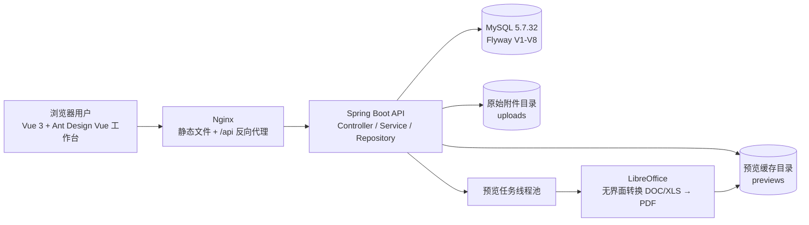
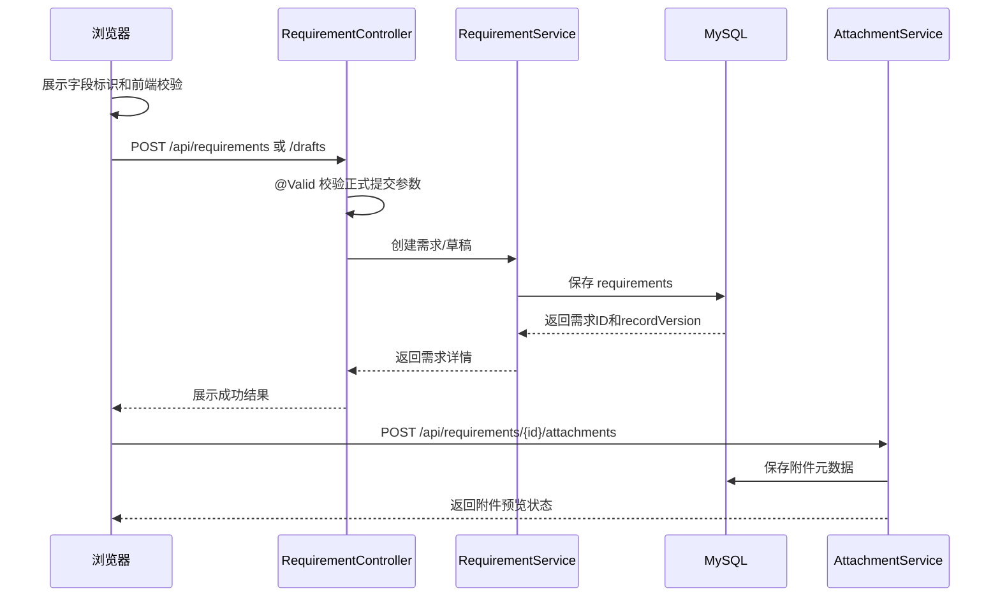
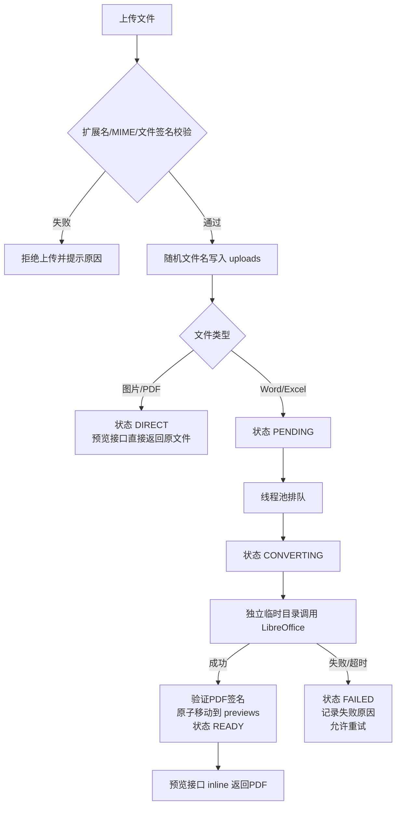

# 需求收集平台系统技术实现方案

**文档版本：** V1.1  
**编制日期：** 2026年7月23日  
**适用系统：** 需求收集平台  
**文档定位：** 面向产品评审、研发、测试和运维的技术落地说明

## 1. 先说清楚：本方案与部署文档的关系

`docs/deployment.md` 是“部署与运维手册”，主要说明环境变量、启动命令、Nginx、LibreOffice安装、备份恢复和故障处理；它不是完整的系统技术实现方案。

本文回答以下问题：

- 系统由哪些模块组成，模块之间如何调用？
- 必填/选填标识如何与前后端校验保持一致？
- 需求、系统、版本和附件如何落库？
- 图片、PDF、Word、Excel预览分别如何处理？
- 接口、状态、异常、测试和上线验收如何执行？

部署时需要的具体命令和参数仍以 [deployment.md](deployment.md) 为准。

## 2. 一页看懂系统架构



### 2.1 技术栈

| 层次 | 技术 | 作用 |
|---|---|---|
| 页面 | Vue 3、TypeScript、Vite、Ant Design Vue、Ant Design Icons Vue、Axios | 侧栏工作台、表单、查询、管理和预览交互 |
| API | Java 17、Spring Boot 3.3、Spring Web | REST接口、参数校验、异常响应 |
| 业务 | Spring Service、Spring Data JPA | 需求、系统、版本、附件业务规则 |
| 数据库 | MySQL 5.7.32、Flyway | 业务数据持久化和增量迁移 |
| 文件 | 本地 `uploads`、`previews` 目录 | 原始附件和预览缓存分离保存 |
| Office转换 | LibreOffice headless | Word/Excel转换为PDF |
| 部署 | Nginx + Java进程/服务管理 | 前端托管、API代理、进程运行 |

### 2.2 本期边界

本系统当前不包含登录、账号、单点登录和系统权限隔离。需求填报人、需求处理人、系统管理员是业务操作角色，用于说明操作职责，不代表后端已经实现RBAC权限模型。

## 3. 模块地图

| 模块 | 前端入口 | 后端主要类 | 负责内容 |
|---|---|---|---|
| 需求填写 | `RequirementForm.vue` | `RequirementController`、`RequirementService` | 新建正式需求、暂存草稿、固定部门选择、点击或拖拽上传附件 |
| 需求查询与编辑 | `RequirementList.vue` | `RequirementController`、`RequirementSpecifications` | 多条件查询、详情、编辑、删除、附件管理 |
| 需求处理 | `RequirementManagement.vue` | `RequirementController`、`RequirementService` | 查看待处理需求，并在弹窗中填写状态、完成时间、处理人和完成情况 |
| 系统管理 | `SystemManagement.vue` | `SystemController`、`SystemService` | 系统新增、编辑、停用、迁移 |
| 版本管理 | `SystemManagement.vue` | `SystemVersionController`、`SystemVersionManagementController` | 版本新增、编辑、停用 |
| 附件 | 需求填写/详情页 | `AttachmentController`、`AttachmentService` | 上传、列表、下载、删除、预览 |
| Office预览 | 附件预览弹窗 | `AttachmentPreviewService`、`LibreOfficePreviewGenerator` | 异步转换、缓存、失败重试 |

后端统一经过 `Controller → Service → Repository`，Controller不直接操作数据库；统一异常由 `ApiExceptionHandler` 转换为前端可识别的HTTP错误。

## 4. 核心业务流程

### 4.1 新建需求流程



正式提交和草稿暂存使用不同接口：正式提交执行完整必填校验；草稿允许内容不完整，但页面仍显示正式提交所需的必填标识。

### 4.2 部门选择与校验

填写需求和编辑需求中的“部门”均使用固定选项的下拉选择框，页面不提供自由输入。可选项固定为：`IT部`、`FAE部`、`总经办`、`供应链部`、`财务部`、`产品部`、`市场运营部`、`业务部`、`品质部`、`人力资源部`。

前端从共享的 `DEPARTMENTS` 常量读取该列表，筛选、填写和编辑使用同一来源，避免页面之间出现不一致的部门名称。后端在创建、暂存、编辑和正式更新时通过 `DepartmentPolicy` 再次校验部门值；为保证历史数据可继续读取和维护，后端保留已有历史部门值的兼容处理，但新页面只展示上述十个规范部门。

### 4.3 必填/选填标识流程

1. 页面字段名称右侧显示 `* 必填` 或 `选填`。
2. 所属系统选择“已有系统”时，“已有系统”显示必填；选择“新系统”时，“新系统名称”和“新系统负责人”显示必填。
3. 页面顶部显示统一说明，筛选区只显示一次“筛选条件均为选填”。
4. 用户点击提交时执行浏览器原生必填校验和业务校验。
5. 后端再次执行 `@NotBlank`、`@NotNull`、枚举、日期范围、系统/版本关系等校验。
6. 后端校验失败返回统一错误，前端映射到具体字段并保留顶部错误提示。

前端标识不是校验的唯一依据，后端始终是最终校验边界。

### 4.4 附件预览流程



历史Word/Excel附件在V8迁移后为 `PENDING`；用户打开附件列表时会自动触发排队，不需要人工逐条初始化。

## 5. 前端实现方案

### 5.1 页面组件

| 组件 | 关键实现 |
|---|---|
| `App.vue` | 使用 Ant `Layout`、`LayoutSider` 和 `Menu` 构成侧栏工作台，负责菜单切换、页面缓存和系统管理入口 |
| `RequirementForm.vue` | Ant 表单、新建/草稿、条件字段、固定部门选择，以及点击/拖拽附件选择 |
| `RequirementList.vue` | Ant 查询控件和表格、分页、详情、编辑、拖拽附件上传和附件预览弹窗 |
| `RequirementManagement.vue` | Ant 表格展示待处理需求；“填写处理情况”使用 `Modal` 弹窗承载表单 |
| `SystemManagement.vue` | Ant 风格的系统、迁移管理 |
| `VersionManagement.vue` | Ant 风格的版本新增、编辑、启停管理 |
| `usePageRefresh.ts`、`refreshBus.ts` | 页面激活和业务修改后的事件式数据刷新 |
| `style.css` | 补充 Ant 工作台、字段标识、拖拽区、表格和预览的统一样式 |

### 5.2 Ant Design Vue 侧栏工作台

全站以 Ant Design Vue 的组件和视觉规范为基础。应用外壳使用左侧固定工作台导航，内容区随菜单切换展示“填写需求”“需求列表”“管理需求”“系统管理”和版本相关页面；页面组件使用 `Card`、`Form`、`Select`、`Button`、`Table`、`Tag`、`Modal` 等统一控件，避免同一业务场景同时出现两套控件风格。

页面内容仍由 `KeepAlive` 缓存以保留用户已输入的筛选条件和编辑上下文。缓存页面再次激活时会按刷新规则重新加载业务数据，避免用户看到过期列表。

### 5.3 字段标识规则

统一使用以下样式类，避免页面各自定义颜色和位置：

```html
<label>
  需求标题 <span class="field-required">* 必填</span>
  <input required />
</label>
```

布局规则是“字段名和标记同行，控件另起一行”。在 `style.css` 中，表单标签使用可换行的 Flex 布局，输入框、选择框和文本域占满下一行。

### 5.4 固定部门选择

- 需求填写、编辑和列表筛选共用 `DEPARTMENTS` 常量，使用 Ant `Select` 展示十个规范部门。
- 填写和编辑时不允许手工输入其他部门；筛选项同样只提供规范部门，保证查询条件和存储值一致。
- 旧数据中已有的历史部门可正常显示，前端不会将其自动改写为其他部门。

### 5.5 附件上传与预览交互

- 填写页和编辑弹窗均提供拖拽上传区域；用户可将文件拖入区域，或点击区域打开文件选择器。
- 前端仅接受 JPG/JPEG、PNG、GIF、WEBP、PDF、DOC/DOCX、XLS/XLSX，单个文件不超过 100MB；同一批次按文件名、大小和修改时间去重。
- 选择文件后先显示待上传列表，保存需求或在编辑页点击上传后才提交到附件接口。

- `DIRECT`、`READY`：显示“预览”按钮。
- `PENDING`、`CONVERTING`：显示生成状态，前端按2秒间隔刷新附件列表。
- `FAILED`：显示失败摘要，提供“重新生成”和“下载原文件”。
- 图片直接使用原始附件地址；PDF和Office转换结果在统一弹窗的 `iframe` 中打开。
- 弹窗始终保留“下载原文件”，并提示Office转换可能存在版式差异。
- 组件销毁时清理轮询定时器，避免页面切换后继续请求。

### 5.6 事件驱动的数据刷新

业务列表不使用定时刷新。`usePageRefresh` 在页面首次挂载和 `KeepAlive` 页面重新激活时加载最新数据；`refreshBus` 在成功新增、修改、删除、上传附件、保存处理情况、系统/版本维护后，通知受影响的需求、管理、系统或版本页面刷新。刷新期间会避免同一页面并发请求；“填写处理情况”弹窗打开时暂停该页面的事件刷新，避免覆盖正在填写的内容。

界面不提供手动刷新按钮，也不显示“最后更新时间”。附件的 2 秒轮询仅用于 Office 预览转换状态（`PENDING`、`CONVERTING`），达到终态或离开组件后即停止；它不属于业务数据自动刷新机制。

## 6. 后端实现方案

### 6.1 业务分层

```text
HTTP请求
  ↓
Controller：路径、请求体、@Valid、HTTP状态码
  ↓
Service：业务规则、状态变更、事务、并发控制
  ↓
Repository：JPA查询和持久化
  ↓
MySQL / 文件系统
```

关键实现：

- 正式请求对象使用 `@NotBlank`、`@NotNull` 等Bean Validation注解。
- `RequirementService` 在创建、暂存、编辑和正式更新时调用 `DepartmentPolicy` 校验部门，前端限制不能替代服务端校验。
- 需求更新和系统更新使用 `recordVersion` 做乐观锁，避免覆盖他人修改。
- 软删除使用 `deleted` 和 `deleted_at`，查询默认过滤已删除数据。
- 附件内容不存数据库，数据库只保存元数据和校验值。
- 文件先写临时文件，校验通过后原子移动到正式目录。
- 预览转换与上传请求解耦，转换失败不影响原文件下载。

### 6.2 接口清单

#### 需求

| 方法 | 路径 | 用途 |
|---|---|---|
| POST | `/api/requirements` | 新建正式需求 |
| POST | `/api/requirements/drafts` | 新建草稿 |
| GET | `/api/requirements/page` | 分页筛选需求 |
| GET | `/api/requirements/{id}` | 查看详情 |
| PUT | `/api/requirements/{id}` | 修改正式需求 |
| PUT | `/api/requirements/{id}/draft` | 修改草稿 |
| PATCH | `/api/requirements/{id}/status` | 修改状态 |
| PATCH | `/api/requirements/{id}/processing` | 保存处理情况 |
| DELETE | `/api/requirements/{id}` | 删除需求 |

#### 系统与版本

| 方法 | 路径 | 用途 |
|---|---|---|
| GET/POST | `/api/systems` | 查询/新增系统 |
| PUT | `/api/systems/{id}` | 修改系统 |
| PATCH | `/api/systems/{id}/status` | 启用/停用系统 |
| POST | `/api/systems/{id}/migrate` | 迁移关联需求 |
| GET/POST | `/api/systems/{systemId}/versions` | 查询/新增版本 |
| PUT | `/api/system-versions/{id}` | 修改版本 |
| PATCH | `/api/system-versions/{id}/status` | 启用/停用版本 |

#### 附件

| 方法 | 路径 | 用途 |
|---|---|---|
| POST | `/api/requirements/{id}/attachments` | 上传附件 |
| GET | `/api/requirements/{id}/attachments` | 查询附件列表和预览状态 |
| GET | `/api/attachments/{id}` | 下载原文件，`attachment` |
| GET | `/api/attachments/{id}/preview` | 在线预览，`inline` |
| POST | `/api/attachments/{id}/preview/retry` | 重试Office预览 |
| DELETE | `/api/attachments/{id}` | 删除附件及预览缓存 |

#### AI

| 方法 | 路径 | 用途 |
|---|---|---|
| POST | `/api/ai/analyze` | 文本需求分析，返回结构化字段 |
| POST | `/api/ai/analyze-image` | 需求截图识别（multipart `file`），返回与文本分析相同结构 |

### 6.3 附件预览状态机

```text
PENDING ──开始任务──> CONVERTING ──成功──> READY
   │                      │
   │                      └──失败/超时──> FAILED ──重试──> PENDING
   └──历史附件列表触发排队

图片/PDF ───────────────────────────────> DIRECT
```

状态由后端维护，前端只能读取状态或调用重试接口，不能通过请求参数直接伪造 `READY`。

### 6.4 Office转换安全边界

- 只允许白名单扩展名和MIME类型。
- 上传时检查文件签名，不能只信任文件后缀。
- LibreOffice使用独立临时目录和独立用户配置目录。
- 默认单文件超时60秒、并发2个，可通过环境变量调整。
- 转换输出必须是非空、签名正确的PDF，再原子移动到预览目录。
- 原文件、预览缓存和临时文件使用不同目录，删除预览缓存不影响原文件下载。
- 错误提示不返回服务器绝对路径、命令行或敏感堆栈信息。

### 6.5 AI 分析与截图识别

- 文本与图片两条路径共用同一套字典 prompt（部门 / 类型 / 系统版本 + JSON schema + 提取规则）与结果校验（`parseAndValidate`），避免规则漂移。
- 图片接口仅接受 png / jpg / webp，以文件魔数为准（不信任扩展名与客户端 MIME），单张上限 10MB；超限或格式不符返回明确文案。
- 图片以 OpenAI 多模态格式发送：`content` 数组 = 文本 prompt + `image_url`（data URL）；图片仅在内存中处理，不落盘、不建附件记录、base64 不入日志。
- 图片请求独立超时 `app.ai.image-request-timeout-seconds`（默认 60，环境变量 `AI_IMAGE_REQUEST_TIMEOUT_SECONDS`）；文本分析仍为 `app.ai.request-timeout-seconds`（默认 30）。
- 视觉能力兜底：模型返回 4xx 且错误体含 image / vision / visual / multimodal / 图片 / 视觉 关键词时，返回引导文案"当前激活模型可能不支持图片识别，请在 AI 配置中切换为视觉模型（如 qwen-vl、glm-4v、mimo-vl 等）后重试"；其他错误沿用文本分析文案。AI 配置支持多配置单激活，用户可为视觉场景另建配置并激活。
- 前端填充规则统一为"只填空字段、不覆盖已有内容"，文本导入与截图识别共用同一实现；截图识别入口在填写页 AI 智能导入面板（上传按钮 + 面板内 Ctrl+V 粘贴），粘贴事件与附件区粘贴监听通过 stopPropagation 隔离。

## 7. 数据模型

### 7.1 业务表

| 表 | 作用 | 关键字段 |
|---|---|---|
| `systems` | 系统主数据 | `name`、`owner_name`、`status`、`record_version`、`deleted` |
| `system_collaborators` | 系统协助人 | `system_id`、`collaborator_name` |
| `system_versions` | 系统版本 | `system_id`、`name`、`status`、`active_name_key` |
| `requirements` | 需求主数据 | 标题、内容、系统、版本、状态、处理信息、`save_type` |
| `attachments` | 附件元数据 | 原文件信息、`checksum`、预览状态和预览路径 |

### 7.2 V8附件字段

| 字段 | 说明 |
|---|---|
| `preview_status` | `DIRECT/PENDING/CONVERTING/READY/FAILED/UNAVAILABLE` |
| `preview_relative_path` | 预览PDF相对路径 |
| `preview_content_type` | 预览响应类型 |
| `preview_generated_at` | 最近成功生成时间 |
| `preview_error_message` | 脱敏后的失败摘要 |
| `preview_retry_count` | 重试次数 |

数据库结构只通过 `V1` 至 `V8` 的Flyway脚本变更，应用启动时使用 `ddl-auto: validate` 校验实体和数据库结构一致。

## 8. 异常、并发和恢复策略

| 场景 | 系统行为 | 用户看到的结果 |
|---|---|---|
| 必填项为空 | 前后端校验拦截 | 字段下方显示原因并定位 |
| 文件格式或签名不匹配 | 上传拒绝 | 提示不支持或格式不匹配 |
| 磁盘空间不足 | 上传拒绝 | 原文件不落盘，提示空间不足 |
| LibreOffice超时 | 任务失败并记录原因 | 可下载原文件，可重新生成 |
| 预览缓存丢失 | 预览接口返回异常 | 保留原文件下载，可重新生成 |
| 同一附件重复转换 | 应用内任务去重 | 不产生重复转换任务 |
| 多人同时编辑 | `recordVersion` 乐观锁 | 后保存者收到版本冲突提示 |
| 数据库迁移失败 | 应用启动失败 | 保留旧版本服务，按迁移日志回退 |

预览目录属于可重建缓存。备份策略、恢复步骤和LibreOffice安装方式见 [deployment.md](deployment.md) 与 [backup-and-recovery.md](backup-and-recovery.md)。

## 9. 测试与验收

### 9.1 前端

- 验证侧栏工作台导航、Ant 表单/表格/弹窗等核心交互可用，页面切换后保留必要的填写和筛选上下文。
- 新建、草稿、编辑、处理、系统和版本页面均可看到正确的必填/选填标识。
- 标识位于字段名右侧，不出现在输入控件下方。
- 验证部门下拉框在填写、编辑和筛选中只显示十个规范部门。
- 正式提交空必填项被拦截，草稿可以暂存不完整内容。
- 验证附件可点击选择或拖入上传区；不支持的格式、超过 100MB 的文件和重复文件会被正确处理。
- 验证附件可通过 Ctrl+V 粘贴（截图 / 复制文件 / 富文本内联图），远程图片仅提示不下载；粘贴事件仅拦截图片 / 文件 / 含图 HTML，纯文本粘贴保留浏览器默认行为，浮层（Modal / Popover）内粘贴不受干扰。
- 验证“填写处理情况”以弹窗打开，保存成功后关闭并刷新管理需求和需求列表。
- 验证首次进入、切换回缓存页面和业务修改后会刷新受影响页面；页面中没有手动刷新按钮和“最后更新时间”，且没有业务数据的定时请求。
- 图片、PDF、Word、Excel分别验证预览按钮、加载中、成功、失败和重试状态。
- 页面离开后预览轮询停止。

### 9.2 后端

- 校验接口参数和字段错误映射。
- 验证 `DepartmentPolicy` 拒绝不在规则内的部门值，并验证既有历史部门数据的兼容处理。
- 验证原始附件下载与预览接口的响应头不同：下载使用 `attachment`，预览使用 `inline`。
- 验证图片/PDF直接预览和Office转换状态流转。
- 验证转换超时、失败重试、缓存删除和历史附件按需转换。
- 验证相同附件不会重复排队。
- 验证Flyway V8在MySQL 5.7.32上可执行。

### 9.3 上线验收清单

1. 执行数据库备份并记录批次号。
2. 确认Java、MySQL、LibreOffice和附件目录权限。
3. 启动后检查 `/api/health` 返回 `UP`。
4. 检查侧栏工作台、新建正式需求、草稿、处理弹窗和系统管理表单。
5. 从十个部门中选择一个填写需求，并分别通过点击和拖拽上传图片、PDF、Word、Excel各一个，验证预览和原文件下载。
6. 制造一次转换失败，验证失败提示和重试按钮。
7. 抽查历史附件，确认`PENDING`文件能够自动排队。
8. 切换页面并完成一次需求修改，确认相关列表自动刷新，且界面不出现手动刷新按钮或“最后更新时间”。
9. 检查日志、磁盘空间、预览缓存和备份清单。

## 10. 开发与发布顺序

| 阶段 | 输出物 | 完成标准 |
|---|---|---|
| 1. 字段规则 | 统一标识和校验 | 页面提示与后端规则一致 |
| 2. 附件元数据 | V8迁移、状态和响应字段 | 旧附件可正常读取 |
| 3. 预览服务 | 直出、转换、缓存、重试 | 四类文件可按状态预览 |
| 4. 前端工作台与预览 | Ant 侧栏工作台、固定部门、拖拽上传、处理弹窗、事件刷新、预览轮询 | 用户可完成统一风格的填报、处理、管理和附件预览 |
| 5. 文档与部署 | 技术方案、操作手册、部署参数 | 研发、测试、运维可按文档执行 |
| 6. 回归验收 | 自动化测试和上线检查表 | 测试通过后发布 |

## 11. 关联文档

- [需求优化建设计划书](superpowers/specs/2026-07-20-required-fields-attachment-preview-plan-design.md)
- [角色操作手册](用户指导手册.md)
- [部署与迁移说明](deployment.md)
- [备份与恢复检查表](backup-and-recovery.md)
- [MySQL 5.7.32兼容性方案](mysql-5.7.32-compatibility-plan.md)
